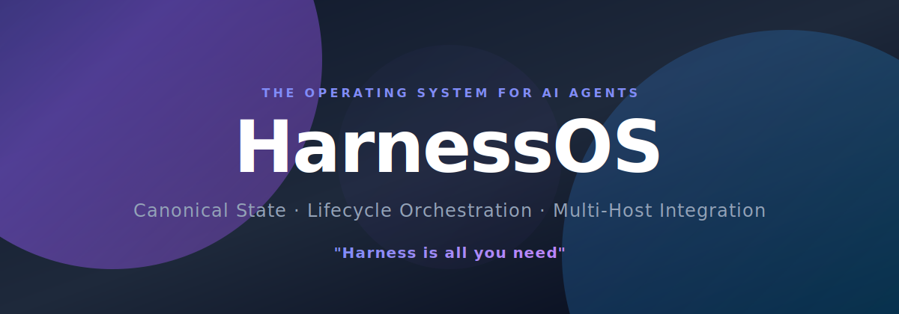

<div align="center">
  

  # HarnessOS

  <p><strong>The operating system for autonomous AI agents.</strong></p>
  <p><em>"Harness is all you need"</em></p>

  [](https://www.npmjs.com/package/harness-os)
  [](LICENSE)
  []()
  [](https://www.giulioleone.com)
  [](https://www.linkedin.com/in/giulioleone-ai/)

  <p align="center">
    <a href="#-what-is-a-harness">What is a Harness?</a> •
    <a href="#-key-features">Key Features</a> •
    <a href="#-getting-started">Getting Started</a> •
    <a href="#-architecture">Architecture</a> •
    <a href="CHANGELOG.md">Changelog</a> •
    <a href="#%EF%B8%8F-developer">Developer</a>
  </p>
</div>

---

## 🧬 What is a Harness?

In AI, an LLM can *think*. A tool can *act*. But neither can **persist, recover, coordinate, or remember** on its own.

A **Harness** is the missing execution layer. It is the infrastructure that wraps around AI agents to give them:

- **Persistence** — Every task, every checkpoint, every event is written to a canonical SQLite store. If the agent dies, the work survives.
- **Lifecycle** — Tasks follow a strict state machine (`pending → ready → in_progress → done/failed`). Leases prevent two agents from claiming the same work. Stale leases are automatically recovered.
- **Memory** — Optional semantic memory powered by `mem0` allows agents to recall context across sessions, threads, and even projects — without polluting the canonical state.
- **Coordination** — Dependency chains between tasks are resolved automatically. When task A completes, its dependents are promoted to `ready`. No human intervention needed.
- **Portability** — The harness is agent-agnostic and IDE-agnostic. It works with Copilot, Gemini, Cursor, Windsurf, or any custom runtime. Set it up once, use it everywhere.

### Why does this matter?

Without a harness, every AI agent is a **stateless function call**. It forgets everything between sessions. It can't coordinate with other agents. It can't recover from crashes. It can't prove what it did or why.

**HarnessOS turns disposable AI into a persistent, self-healing, auditable system.**

Think of it this way:
- An LLM is a CPU.
- Tools are peripherals.
- **HarnessOS is the operating system that makes them work together reliably.**

---

## 🚀 Overview

**HarnessOS** provides the foundational execution framework for advanced autonomous agents. It focuses strictly on robust lifecycle management, leaving LLM inference and tool implementation to the consumer.

Latest release notes and breaking changes are tracked in [CHANGELOG.md](CHANGELOG.md). The canonical hard-cut release checklist and fail-fast contract boundaries live in [docs/release-playbooks.md](docs/release-playbooks.md).

### Schema compatibility

- HarnessOS now enforces SQLite schema v5 as the only supported runtime store contract.
- Existing v2 databases are not migrated in place; opening them fails fast with an explicit recreate instruction.
- The runtime now persists `blocked_reason` on issues and milestones so dependency blockers are explicit, inspectable, and recomputed deterministically when queue state changes.
- The public package stays on the **2.x release line**; schema, contract, and bundled-skill versions are tracked independently per surface so runtime cuts remain explicit without forcing a new package major every time one internal contract moves.

### What it handles:
- **Zod Plan Contracts** — Strongly typed schema validation for robust planning.
- **Session Contracts** — Standardized agent execution lifecycles.
- **Skill-Policy Registry** — Dynamic management of agent capabilities and operational rules.
- **Canonical SQLite Store** — Robust, ACID-compliant state layer for leases, checkpoints, events, and task states.
- **Session Orchestration** — High-level inspection, queue promotion, and task lifecycle management.

---

## ⚡ Key Features

### 🗄️ Canonical SQLite State
SQLite acts as the absolute source of truth for:
- **Leases** — Task-scoped locks to prevent concurrent race conditions.
- **Checkpoints** — Snapshot history of agent progress.
- **Events** — Immutable transaction logs.
- **Task State** — Workflow queues and resolutions.

### 📋 Batch-First Planning & Promotion
- `harness_orchestrator(action: "plan_issues")` accepts a canonical `milestones[]` batch only, even when importing a single milestone.
- `create_campaign` accepts an optional typed `policy` object with `owner`, `serviceLevel`, `escalationRules`, and `dispatch`, while `plan_issues` and the scheduler injector accept first-class workflow metadata on issues and milestones through `deadlineAt`, `recipients`, `approvals`, and `externalRefs`.
- Milestone hierarchy is preserved with `depends_on_milestone_keys` for in-batch edges and `depends_on_milestone_ids` for previously imported milestones.
- `promote_queue` advances work only when both issue-level and milestone-level dependencies are truly `done`.
- `harness_inspector(action: "next_action")` now returns a structured `context` block that points to the exact issue, milestone, blocker, lease, or policy escalation behind the recommendation, so queue decisions are auditable instead of heuristic black boxes.
- Campaign-level policy defaults still merge into issue-level overrides, and claim ordering now considers effective priority, policy breaches, issue deadlines, and the existing aging rules through one shared dispatch path.

### 🧠 Optional Memory Derivation
- Integrating `mem0-mcp` provides advanced semantic memory and context extraction.
- **Lazy Loading** — Derived memory is loaded *only* when needed to conserve resources.
- **Failsafe Operations** — If `mem0-mcp` is unavailable, the harness gracefully degrades without corrupting the canonical SQLite tasks.

### 🧭 Capability Discoverability
- `harness_inspector(action: "capabilities")` exposes the runtime tool surface, bundled skills, policy-driven skills, and mem0 state in an agent-readable format.
- The packaged skills under `.github/skills` mirror the canonical runtime contract, so prompts, docs, and MCP discovery stay aligned.
- The bundled skill manifest now publishes explicit workload profiles (`coding`, `research`, `ops`, `sales`, `support`, `assistant`) and per-skill `workloadProfileIds`, so hosts can specialize without hardcoding the core runtime to one domain.
- Human-facing discovery docs now live in one place per surface: [docs/mcp-tools.md](docs/mcp-tools.md) for MCP tools, [docs/cli-reference.md](docs/cli-reference.md) for the installable CLIs, [docs/workload-profiles.md](docs/workload-profiles.md) for workload selection, and [.github/skills/README.md](.github/skills/README.md) for the bundled skill index.

### 🧩 Workload-Aware Skill Sync
- `harness-setup` now records a canonical `selectedWorkloadProfile` for every registered host under `~/.agent-harness/config.json`.
- `harness-sync` installs only the skills required by that workload profile and prunes the rest atomically, instead of shipping one implicit all-skills pack to every host.
- `assistant` remains the explicit full-surface profile when a host must stay multi-domain; other profiles keep the runtime domain-agnostic while specializing guidance at the host edge.
- The repository now ships reference workspaces for `assistant`, `research`, `ops`, and `support` under [`examples/`](examples/) so non-coding teams can start from concrete queues, workflow metadata, and handoff assets instead of coding-only scaffolds.

### ⏱️ Reusable Scheduler Injector
A cron-aware, idempotent injector for scheduled work (`src/bin/scheduler-inject.ts`), supporting full 5-field cron expressions to safely trigger work without duplications.

---

## 💻 Getting Started

### 1️⃣ Installation & Multi-Host Setup

```bash
npm install -g harness-os mem0-mcp
```

HarnessOS targets **Node.js 22+** and ships with installable CLIs for runtime setup, scheduling, and MCP registration.

Register the lifecycle MCP server for Codex, Copilot CLI, and antigravity in one pass:

```bash
# Creates ~/.agent-harness/{harness.sqlite,mem0} if missing and configures the hosts
harness-install-mcp --host codex --host copilot --host antigravity

# Optional: bind a host to a specific workload profile
harness-install-mcp --host copilot --workload-profile research
harness-install-mcp --host codex --workload-profile ops
harness-install-mcp --host antigravity --workload-profile assistant

# Optional: inspect first without writing anything
harness-install-mcp --dry-run
```

You can still register extra host workspaces for skill sync:

```bash
harness-setup
harness-sync
```

`harness-setup` now persists a versioned host-sync config under `~/.agent-harness/config.json`. If you still have the legacy flat `{"hosts":["/path"]}` shape, rerun `harness-setup` once to rewrite it before `harness-sync`. Each sync writes `skills/bundle-manifest.json` to the host and explicitly replaces outdated or drifted bundled skill assets instead of tolerating them indefinitely.
The current host-sync schema is `3`: each host now stores an explicit `selectedWorkloadProfile`, and sync records the installed workload-profile version plus checksum alongside the bundle metadata.

### 2️⃣ Reference workspaces by workload profile

| Profile | Reference workspace | Focus |
|----------|---------------------|-------|
| `assistant` | [`examples/consumer-workspace-template`](examples/consumer-workspace-template/) | generic cross-domain assistant flow with the full bundled skill surface |
| `research` | [`examples/research-workspace-template`](examples/research-workspace-template/) | discovery, synthesis, review, and publish handoff |
| `ops` | [`examples/ops-workspace-template`](examples/ops-workspace-template/) | incident triage, mitigation, execution, and rollback-aware follow-through |
| `support` | [`examples/support-workspace-template`](examples/support-workspace-template/) | case intake, escalation, customer-safe resolution, and KB follow-up |

See [docs/workload-profiles.md](docs/workload-profiles.md) for profile guidance, template pairing, and copy/paste quick starts.

### 2.1️⃣ Discovery reference

| Need | Reference |
|----------|-----------|
| Choose the right MCP mega-tool and action | [docs/mcp-tools.md](docs/mcp-tools.md) |
| Find the right CLI command or flag | [docs/cli-reference.md](docs/cli-reference.md) |
| Choose a workload profile and template | [docs/workload-profiles.md](docs/workload-profiles.md) |
| Find the right bundled skill | [.github/skills/README.md](.github/skills/README.md) |

### 3️⃣ Environment Variables

| Variable | Default Value | Description |
|----------|---------------|-------------|
| `HARNESS_DB_PATH` | `~/.agent-harness/harness.sqlite` | Path to the canonical HarnessOS SQLite store |
| `MEM0_STORE_PATH` | `~/.agent-harness/mem0` | Path to Mem0 semantic storage |
| `OLLAMA_BASE_URL` | `http://127.0.0.1:11434` | URL to the Ollama embedding API |
| `MEM0_EMBED_MODEL` | `qwen3-embedding:latest` | The model used for extracting memory |
| `AGENT_HARNESS_MEM0_MODULE_PATH` | auto-resolved | Optional explicit module path for `mem0-mcp` |
| `HARNESS_WORKLOAD_PROFILE` | unset | Optional active workload profile for MCP capability discovery (`coding`, `research`, `ops`, `sales`, `support`, `assistant`) |
| `AGENT_HARNESS_DISABLE_DEFAULT_MEM0`| N/A | Set to `1` to disable lazy loaded mem0 entirely |

### 4️⃣ Running Commands

```bash
# Run the cron-aware scheduler injector
harness-scheduler-inject

# Run the standard CLI session lifecycle
harness-session-lifecycle

# Start the MCP (Model Context Protocol) Server for lifecycle orchestration
harness-session-lifecycle-mcp
```

<!-- GENERATED:PUBLIC-CONTRACTS:START -->
### Generated public contract reference

#### Session lifecycle CLI payloads

Every payload must declare `"contractVersion": "6.0.0"`.

| File | CLI action | Purpose |
| --- | --- | --- |
| [`begin-incremental.json`](examples/session-lifecycle/begin-incremental.json) | `begin_incremental` | Claim or resume the next ready issue from the standard CLI. |
| [`begin-recovery.json`](examples/session-lifecycle/begin-recovery.json) | `begin_recovery` | Recover a stale task by superseding the old lease with a recovery session. |
| [`checkpoint.json`](examples/session-lifecycle/checkpoint.json) | `checkpoint` | Persist incremental progress and optional artifacts during an active session. |
| [`close.json`](examples/session-lifecycle/close.json) | `close` | Close the current task after the final validation gate. |
| [`inspect-export.json`](examples/session-lifecycle/inspect-export.json) | `inspect_export` | Export machine-readable queue, lease, run, policy, checkpoint, and recent-event state for a project. |
| [`inspect-audit.json`](examples/session-lifecycle/inspect-audit.json) | `inspect_audit` | Inspect the structured audit trail for one specific issue. |
| [`inspect-health-snapshot.json`](examples/session-lifecycle/inspect-health-snapshot.json) | `inspect_health_snapshot` | Capture a machine-readable operational health snapshot for a project. |
| [`promote-queue.json`](examples/session-lifecycle/promote-queue.json) | `promote_queue` | Promote pending work whose dependencies are now satisfied. |

#### Harness MCP tools
| Tool | Summary | Actions |
| --- | --- | --- |
| `harness_inspector` | Use first in a new session, when queue state is unclear, or when the agent needs a machine-readable guide to the runtime plus auditable next_action reasons, exportable operational state, and health snapshots. | `capabilities`, `get_context`, `next_action`, `export`, `audit`, `health_snapshot` |
| `harness_orchestrator` | Use to create scope, inject planned work, promote dependencies, and reset stuck issues. | `init_workspace`, `create_campaign`, `plan_issues`, `promote_queue`, `rollback_issue` |
| `harness_symphony` | Use for fully agentic multi-issue execution after project planning exists: compile orchestration slices, dispatch ready issues into isolated worktrees, and inspect evidence-backed orchestration state. | `compile_plan`, `dispatch_ready`, `inspect_state` |
| `harness_session` | Use for claim/resume, checkpointing, close/advance, and lease heartbeat during execution. | `begin`, `begin_recovery`, `checkpoint`, `close`, `advance`, `heartbeat` |
| `harness_artifacts` | Use to persist references to screenshots, browser state, generated files, or other task evidence. | `save`, `list` |
| `harness_admin` | Use for recovery-oriented maintenance, retention cleanup, and project-level memory snapshots or rollups. | `reconcile`, `drain`, `archive`, `cleanup`, `mem0_snapshot`, `mem0_rollup` |
<!-- GENERATED:PUBLIC-CONTRACTS:END -->

### 4️⃣ Planning Payloads

As of `2.0.0`, queue planning is batch-first:

<!-- GENERATED:PLAN-ISSUES-EXAMPLE:START -->
```json
{
  "action": "plan_issues",
  "projectName": "Agent Harness Core",
  "campaignName": "Runtime hardening",
  "milestones": [
    {
      "milestone_key": "runtime-foundations",
      "description": "Agentic-first runtime improvements",
      "issues": [
        {
          "task": "Add capability introspection",
          "priority": "high",
          "size": "M",
          "deadlineAt": "2026-04-10T12:00:00.000Z",
          "recipients": [
            {
              "id": "platform-ops",
              "kind": "team",
              "label": "Platform Ops",
              "role": "approver"
            }
          ],
          "approvals": [
            {
              "id": "release-signoff",
              "label": "Release sign-off",
              "recipientIds": [
                "platform-ops"
              ],
              "state": "pending"
            }
          ],
          "externalRefs": [
            {
              "id": "runbook-capability-rollout",
              "kind": "runbook",
              "value": "ops://runbooks/capability-rollout",
              "label": "Capability rollout runbook"
            }
          ],
          "policy": {
            "escalationRules": [
              {
                "trigger": "deadline_breached",
                "action": "raise_priority",
                "priority": "critical"
              }
            ]
          }
        }
      ]
    },
    {
      "milestone_key": "runtime-polish",
      "description": "Follow-up polish",
      "depends_on_milestone_keys": [
        "runtime-foundations"
      ],
      "issues": [
        {
          "task": "Tighten tool discoverability prompts",
          "priority": "medium",
          "size": "S"
        }
      ]
    }
  ]
}
```
<!-- GENERATED:PLAN-ISSUES-EXAMPLE:END -->

---

## 🧩 Architecture

For an in-depth look at how HarnessOS works, refer to the [Architecture Documentation](docs/architecture.md). The Symphony-style no-schema orchestration boundary is documented in [docs/orchestration-no-schema-v1.md](docs/orchestration-no-schema-v1.md). Release highlights and migrations live in [CHANGELOG.md](CHANGELOG.md).

The typical execution flow:
1. `harness_orchestrator(action: "plan_issues")` — Imports a canonical milestone batch into the queue.
2. `beginIncrementalSession()` — Claims a ready task.
3. `beginRecoverySession()` — Resolves and overrides a stuck or failed task.
4. `checkpoint()` — Writes immediate progress to SQLite.
5. `close()` — Releases the lease and promotes newly eligible work.

---

## 🤝 Contributing

We welcome contributions to make HarnessOS even better! Please read our [Contributing Guidelines](CONTRIBUTING.md) to get started with setting up the project and submitting pull requests.

---

## 👨‍💻 Developer & Creator

<div align="center">
  <h3><strong>Giulio Leone</strong></h3>
  <p>AI Architect & Software Engineer</p>

  [](https://www.linkedin.com/in/giulioleone-ai/)
  [](https://www.giulioleone.com)
  
  <p><em>Built with passion to push the boundaries of automated intelligence, self-repairing agentic systems, and highly reliable execution state machines. Have questions, ideas, or feedback? I'd love to connect!</em></p>
</div>

---

## 📄 License

This project is licensed under the **Business Source License 1.1 (BSL)**.

You may use this software for **non-commercial** and **non-production** purposes (e.g., development, testing, research, and personal projects) **free of charge**.

> ⚠️ Commercial and production use is strictly prohibited without prior written authorization.

*On March 22, 2030, this license automatically converts to the **Apache License, Version 2.0**.*
