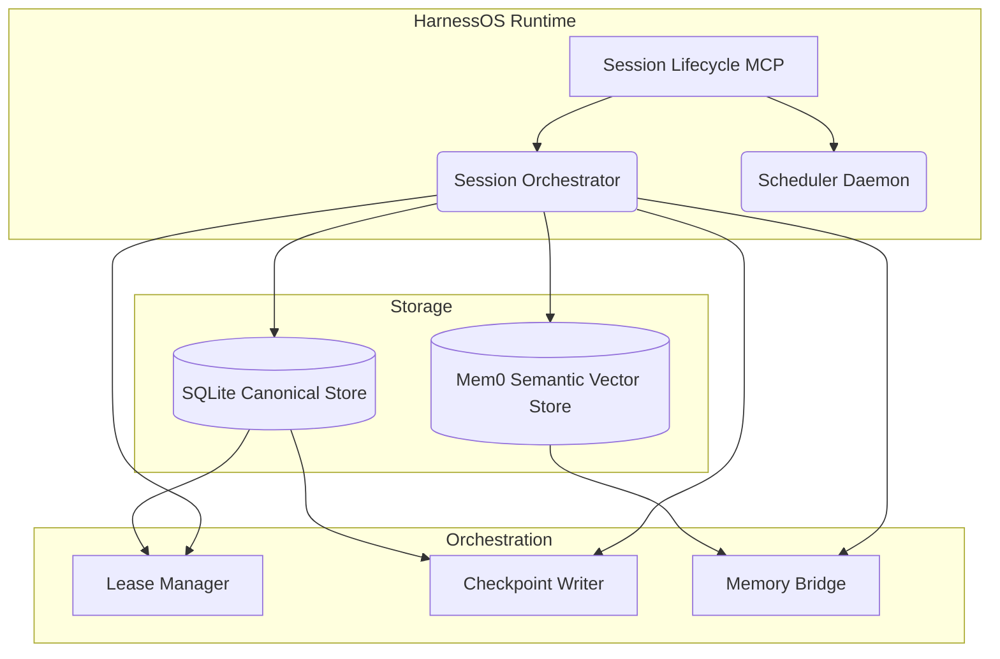

# Architecture

**HarnessOS** is designed around a clean separation of concerns: separating canonical, transactional storage from derived semantic memory, and decoupling tool/capability registries from task operational flows.

## 1. Core Principles

- **Canonical Execution State**: All tasks, leases, events, and checkpoints are stored in an ACID-compliant SQLite datastore. This is the single source of truth.
- **Derived Semantic Memory**: Extracting logic (via mem0) is supplementary. If semantic extraction fails, task progression continues regardless. Canonical state is never compromised.
- **Idempotency**: Retries, duplicated cron triggers, and abrupt agent crashes are expected. The lease manager tracks "stale" ownership and triggers automatic recovery pipelines.
- **Policy-Aware Dispatch**: Campaigns and issues carry typed operational policy (`owner`, service expectations, escalation rules, dispatch), while issues and milestones carry first-class workflow metadata (`deadlineAt`, `recipients`, `approvals`, `externalRefs`). The dispatcher evaluates the effective merged policy plus canonical issue deadlines before choosing the next claimable task.
- **Event-Sourced Traceability**: Operations on a task are tracked via immutable events. You can rebuild a task's full execution context strictly from SQLite events.
- **Host Agnosticism**: HarnessOS doesn't care if you're running Copilot, Gemini, Cursor, Windsurf, or a custom CLI. It works through a universal setup that synchronizes skills and state across any registered host.

## 2. Why a Harness?

A harness is the missing middleware between LLMs and useful work. Without it:
- Agents are stateless — they forget everything between sessions.
- There's no coordination — two agents can claim the same task.
- There's no recovery — a crash means lost progress.
- There's no audit trail — you can't prove what happened or why.

HarnessOS solves all of this with a minimal, robust, SQLite-backed execution layer.

## 3. Component Layout

### The Session Orchestrator
Responsible for coordinating tasks throughout their lifecycle. Provides a standard adapter to MCP clients, CLI interfaces, and integrated API applications.

### The Memory Bridge
Uses `mem0-mcp` to process complex AI experiences down into vector spaces, retaining context between long-running threads of execution while allowing for immediate recall.

## 4. Workload Profiles

HarnessOS now models workload specialization as a first-class runtime concept instead of a single implicit "all skills" pack.

- **Canonical profile registry**: the bundled manifest publishes six workload profiles (`coding`, `research`, `ops`, `sales`, `support`, `assistant`) with explicit skill membership, guidance, version, and checksum metadata.
- **Atomic host replacement**: `harness-setup` persists a selected workload profile per host, and `harness-sync` copies only the skills required by that profile while pruning the rest in the same pass.
- **Discoverability without domain lock-in**: capability metadata exposes workload-profile membership for every bundled skill, but the core scheduler, lifecycle orchestrator, lease manager, and SQLite state machine remain domain-agnostic.
- **Assistant as the full-surface profile**: hosts that must stay multi-domain can choose `assistant`, which ships the complete bundled skill set without keeping the removed `runtime-default` alias alive.
- **Decoupled versioning**: the public package remains on the `2.x` line, while schema, contract, and workload-profile versions move independently so each boundary can stay explicit without forcing package-major churn.

The repository also publishes reference workspaces that pair the profile model with concrete queue examples. `examples/consumer-workspace-template` is the generic `assistant` path, while `examples/research-workspace-template`, `examples/ops-workspace-template`, and `examples/support-workspace-template` demonstrate non-coding mission catalogs, handoff assets, and first-class workflow metadata in realistic domains.
For authoritative action-by-action tool documentation, use [mcp-tools.md](mcp-tools.md); for command-level entrypoints, use [cli-reference.md](cli-reference.md).

## 5. Symphony-style orchestration without schema v6

HarnessOS now has a Symphony-inspired orchestration layer that maps isolated, issue-scoped agent runs onto the existing schema-v5 lifecycle store instead of adding a parallel scheduler database. The design keeps the canonical state in `issues`, `leases`, `runs`, `checkpoints`, `events`, `artifacts`, and `active_sessions`, then layers deterministic worktree metadata, subagent routing, conflict locks, evidence artifact persistence, read-only orchestration inspection, dashboard view models, and a deterministic single-tick supervisor runtime on top.

The detailed contract map, table ownership, and public/internal boundary rules live in [orchestration-no-schema-v1.md](orchestration-no-schema-v1.md).

## 6. The Execution Flow

1. **Discover Capabilities**: Using `harness_inspector(action: "capabilities")`, hosts read the tool catalog, workload profile, and `orchestration` block that advertises Symphony mode, `harness_symphony` actions, dispatch requirements, worktree isolation semantics, accepted evidence artifact kinds, and runtime metadata artifact kinds.
2. **Plan Issues**: Using `harness_symphony(action: "compile_plan")` for Symphony-style slices or `harness_orchestrator(action: "plan_issues")` for canonical batches, top-level objectives are converted into a canonical `milestones[]` batch with issue-level chains and milestone-level dependencies.
3. **Supervise, Dispatch, or Begin**: Fully agentic hosts can call `runOrchestrationSupervisor()` or `harness-supervisor` for bounded autonomous polling, or `runOrchestrationSupervisorTick()` for one deterministic dry-run/execute tick. MCP hosts can use `harness_symphony(action: "supervisor_run")` for the same bounded loop, or still call `dashboard_view`, `promote_queue`, and `dispatch_ready` as separate steps. Single-worker hosts use `harness_session(action: "begin")` to claim one unblocked task. In all claim paths, leases are atomically assigned to prevent duplicate work.
4. **Checkpoint**: While working, an agent stores checkpoint metadata and artifact links securely to the DB.
5. **Close**: Task returns success/failure and its dependencies are subsequently unblocked or halted.

By adhering to this strict state machine flow, large multi-agent systems coordinate flawlessly — regardless of which IDE or AI runtime is driving them.

`harness_inspector(action: "next_action")` follows the same queue priority chain instead of guessing heuristically: expired leases, recovery work, ready work, blocked work, pending promotion, then idle. Its response now carries structured context about the exact issue, milestone, blocker, lease, or active policy breach that drove the recommendation, so operators can audit why a specific tool call was suggested.

The read-only observability surface is now split explicitly by intent:
- `harness_inspector(action: "export")` returns a machine-readable operational export for a project or campaign.
- `harness_inspector(action: "audit")` reconstructs the evidence trail for a single issue, including normalized timeline entries for leases, checkpoints, memory links, and events.
- `harness_inspector(action: "health_snapshot")` emits a point-in-time health snapshot with queue counts, stale-lease alerts, session activity, and policy breach summaries.

Operational policy is persisted natively in SQLite through `campaigns.policy_json` and `issues.policy_json`. Campaign policy provides defaults, issue policy provides overrides, and the effective merged policy is what export, issue audit, health snapshots, `next_action`, and lease claim selection all use. Workflow metadata is persisted separately through first-class issue and milestone fields (`deadline_at`, `recipients_json`, `approvals_json`, `external_refs_json`), so non-coding coordination data no longer has to masquerade as policy just to remain visible or sortable.
