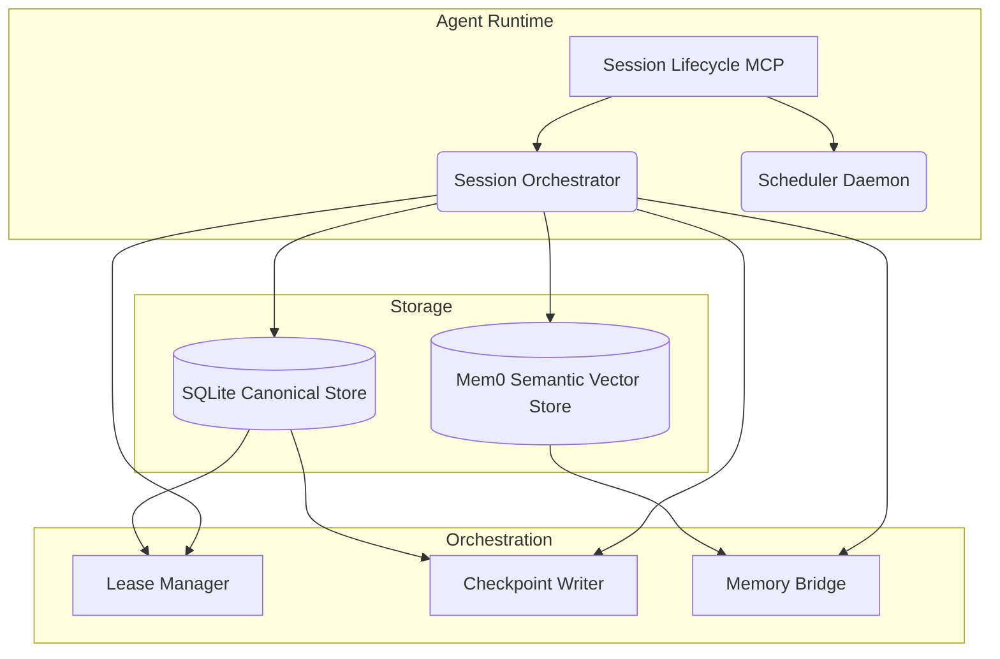

# Architecture

The **Agent Harness Core** is designed around a clean separation of concerns: separating canonical, transactional storage from derived semantic memory, and decoupling tool/capability registries from task operational flows.

## 1. Core Principles

- **Canonical Execution State**: All tasks, leases, events, and checkpoints are stored in an ACID-compliant SQLite datastore.
- **Derived Semantic Memory**: Extracting logic (via mem0) is supplementary. If semantic extraction fails, task progression successfully continues regardless.
- **Idempotency**: Retries, duplicated cron triggers, and abrupt agent crashes are expected. The lease manager securely tracks "stale" ownership and handles automatic recovery pipelines.
- **Event-Sourced Traceability**: Operations on a task are tracked via immutable events. You can rebuild a task's full execution context strictly from SQLite events.

## 2. Component Layout

### The Session Orchestrator
Responsible for coordinating tasks throughout their lifecycle. Provides a standard adapter to MCP clients, CLI interfaces, and integrated API applications. 

### The Memory Bridge
Uses `mem0-mcp` to process complex AI experiences down into vector spaces, retaining context between long-running threads of execution while allowing for immediate recall. 

## 3. The Execution Flow

1. **Plan Issues**: Using `harness_plan_issues`, top level objectives are converted into manageable sub-tasks.
2. **Begin Task**: An agent claims the next unblocked task. A lease is atomically assigned, saving the target task from duplicates.
3. **Checkpoint**: While working, an agent stores checkpoint metadata securely to the DB.
4. **Close**: Task returns success/failure and its dependencies are subsequently unblocked or halted.

By adhering to this strict state machine flow, large multi-agent systems coordinate flawlessly.
