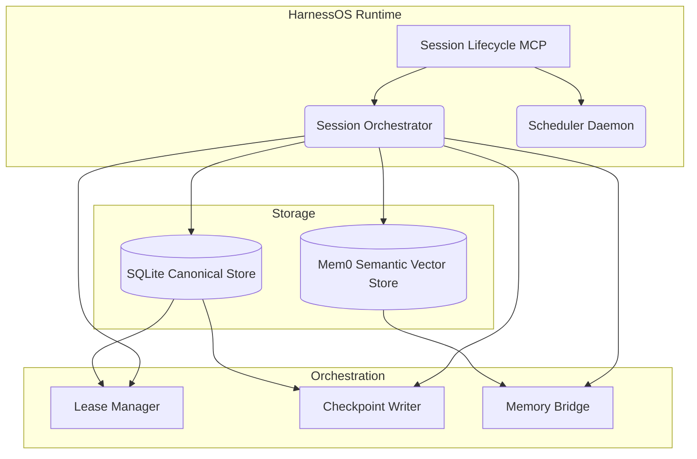

# Architecture

**HarnessOS** is designed around a clean separation of concerns: separating canonical, transactional storage from derived semantic memory, and decoupling tool/capability registries from task operational flows.

## 1. Core Principles

- **Canonical Execution State**: All tasks, leases, events, and checkpoints are stored in an ACID-compliant SQLite datastore. This is the single source of truth.
- **Derived Semantic Memory**: Extracting logic (via mem0) is supplementary. If semantic extraction fails, task progression continues regardless. Canonical state is never compromised.
- **Idempotency**: Retries, duplicated cron triggers, and abrupt agent crashes are expected. The lease manager tracks "stale" ownership and triggers automatic recovery pipelines.
- **Event-Sourced Traceability**: Operations on a task are tracked via immutable events. You can rebuild a task's full execution context strictly from SQLite events.
- **Host Agnosticism**: HarnessOS doesn't care if you're running Copilot, Gemini, Cursor, Windsurf, or a custom CLI. It works through a universal setup that synchronizes skills and state across any registered host.

## 2. Why a Harness?

A harness is the missing middleware between LLMs and useful work. Without it:
- Agents are stateless — they forget everything between sessions.
- There's no coordination — two agents can claim the same task.
- There's no recovery — a crash means lost progress.
- There's no audit trail — you can't prove what happened or why.

HarnessOS solves all of this with a minimal, robust, SQLite-backed execution layer.

## 3. Component Layout

### The Session Orchestrator
Responsible for coordinating tasks throughout their lifecycle. Provides a standard adapter to MCP clients, CLI interfaces, and integrated API applications.

### The Memory Bridge
Uses `mem0-mcp` to process complex AI experiences down into vector spaces, retaining context between long-running threads of execution while allowing for immediate recall.

## 4. The Execution Flow

1. **Plan Issues**: Using `harness_orchestrator(action: "plan_issues")`, top-level objectives are converted into a canonical `milestones[]` batch with issue-level chains and milestone-level dependencies.
2. **Begin Task**: An agent claims an unblocked task. A lease is atomically assigned, saving the target task from duplicates.
3. **Checkpoint**: While working, an agent stores checkpoint metadata securely to the DB.
4. **Close**: Task returns success/failure and its dependencies are subsequently unblocked or halted.

By adhering to this strict state machine flow, large multi-agent systems coordinate flawlessly — regardless of which IDE or AI runtime is driving them.
